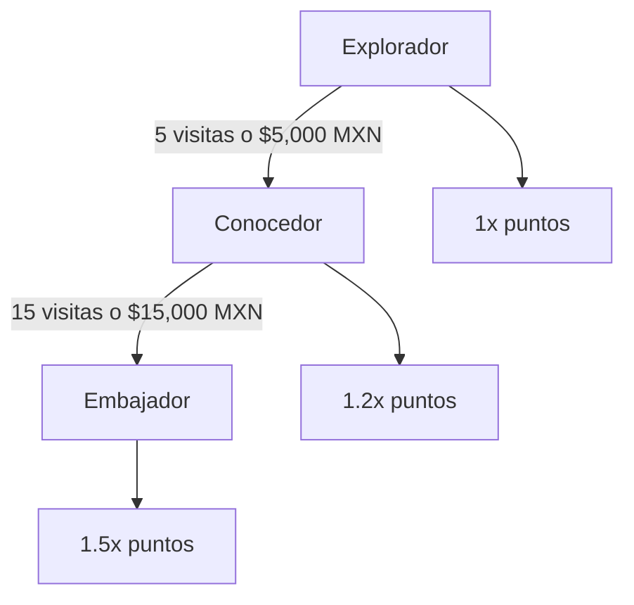

# LoyaltyVibes - Wiki Completa

## 📚 Documentación del Proyecto

Esta wiki contiene toda la información sobre el proyecto LoyaltyVibes.

---

## 📖 Estructura de la Documentación

### [01 - Introducción](01-introduccion.md)
Visión general del proyecto, funcionalidades, casos de uso y flujos.
- ¿Qué es LoyaltyVibes?
- Funcionalidades del sistema
- Casos de uso detallados
- Diagramas de flujos

### [02 - Manual Técnico](02-manual-tecnico.md)
Documentación técnica para desarrolladores.
- Arquitectura del sistema
- Estructura del proyecto
- Base de datos (esquema, RLS, triggers)
- API y servicios
- Seguridad
- Funcionalidades offline
- Guía de despliegue

### [03 - Manual de Usuario](03-manual-usuario.md)
Guía para usuarios finales.
- Primeros pasos
- Guía del cliente
- Guía del personal
- Guía del administrador
- Preguntas frecuentes
- Solución de problemas

---

## 🎯 Resumen por Rol

### Para Clientes
Consultar: [Manual de Usuario - Guía del Cliente](03-manual-usuario.md#guía-del-cliente)

### Para Personal
Consultar: [Manual de Usuario - Guía del Personal](03-manual-usuario.md#guía-del-personal)

### Para Administradores
Consultar: [Manual de Usuario - Guía del Administrador](03-manual-usuario.md#guía-del-administrador)

### Para Desarrolladores
Consultar: [Manual Técnico](02-manual-tecnico.md)

---

## 🔗 Recursos Adicionales

### Documentación del Proyecto
- [README.md](../../README.md) - Documentación principal
- [CLAUDE.md](../../CLAUDE.md) - Configuración MoAI-ADK
- [doc/dataset.md](../dataset.md) - Auditoría estratégica original

### Código Fuente
- [`src/app/`](../../src/app/) - Rutas y páginas
- [`src/features/`](../../src/features/) - Módulos de negocio
- [`src/shared/`](../../src/shared/) - Componentes compartidos
- [`supabase/`](../../supabase/) - Migraciones de base de datos

### Componentes UI
- [Component Library](../../README.md#estructura-de-componentes) - Catálogo de componentes

---

## 📊 Niveles de Lealtad

| Nivel | Requisitos | Multiplicador |
|-------|------------|---------------|
| Explorador | Registro | 1.0x |
| Conocedor | 5 visitas + $5,000 | 1.2x |
| Embajador | 15 visitas + $15,000 | 1.5x |

---

## 🛠️ Tecnologías

| Categoría | Tecnología |
|-----------|------------|
| Frontend | Next.js 14, TypeScript, React |
| Estilos | Tailwind CSS |
| Backend | Supabase (PostgreSQL + Auth) |
| Offline | Dexie.js (IndexedDB) |
| Validación | Zod + React Hook Form |
| Testing | Vitest + React Testing Library |

---

## 📝 Versión del Documento

| Fecha | Versión | Cambios |
|-------|---------|---------|
| 2026-02-03 | 1.0.0 | Creación inicial de la wiki |

---

**LoyaltyVibes** - Gamificando la lealtad en San Cristóbal de Las Casas
