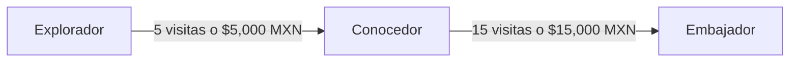
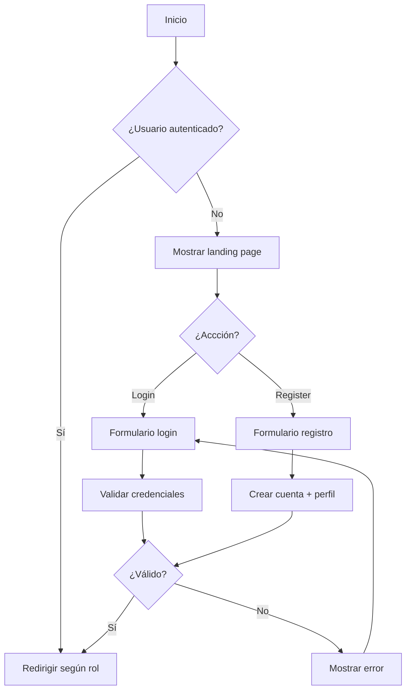
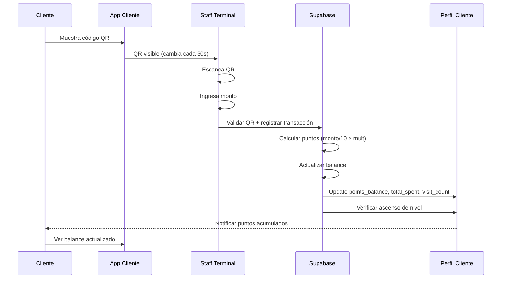
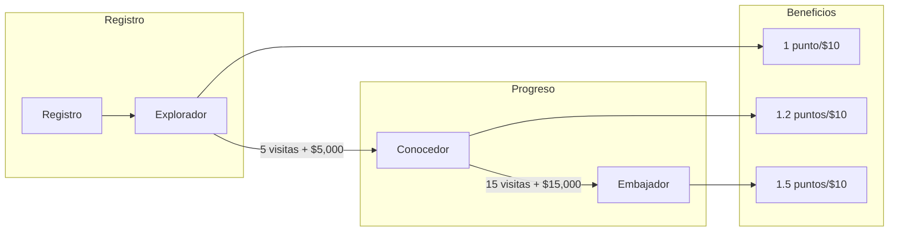
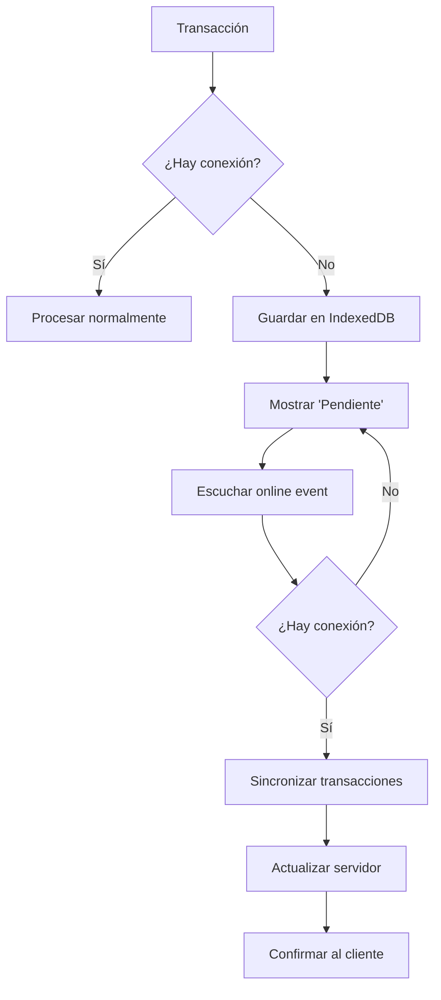

# LoyaltyVibes - Wiki del Proyecto

## Tabla de Contenidos

1. [Introducción al Proyecto](#introducción-al-proyecto)
2. [Funcionalidades del Sistema](#funcionalidades-del-sistema)
3. [Casos de Uso](#casos-de-uso)
4. [Flujos de Usuario](#flujos-de-usuario)
5. [Manual Técnico](02-manual-tecnico.md)
6. [Manual de Usuario](03-manual-usuario.md)

---

## Introducción al Proyecto

### ¿Qué es LoyaltyVibes?

**LoyaltyVibes** es una plataforma de lealtad gamificada diseñada específicamente para el sector de hospitalidad y gastronomía de San Cristóbal de Las Casas, Chiapas. El sistema permite a restaurantes y hoteles implementar programas de fidelización de clientes mediante una aplicación móvil tipo wallet.

### Propósito del Sistema

El proyecto nace de la necesidad de:

1. **Recuperar soberanía de datos**: Los establecimientos locales pierden acceso a información de sus clientes debido a intermediarios digitales (OTAs como Booking.com, Expedia).

2. **Fidelización efectiva**: Crear relaciones a largo plazo con los clientes a través de un sistema de puntos y niveles.

3. **Resiliencia tecnológica**: La infraestructura de internet en Chiapas es inestable, por lo que la aplicación funciona Offline-First.

4. **Gamificación avanzada**: Un sistema de niveles (Explorador → Conocedor → Embajador) que incentiva visitas repetidas.

### Público Objetivo

| Segmento | Descripción |
|----------|-------------|
| **Establecimientos** | Restaurantes, hoteles boutique, cafés de San Cristóbal de Las Casas |
| **Clientes** | Turistas y residentes locales que buscan beneficios por su lealtad |
| **Personal** | Meseros, cajeros y administradores de los establecimientos |

### Stack Tecnológico

| Componente | Tecnología |
|------------|------------|
| Frontend | Next.js 14 (App Router), TypeScript, Tailwind CSS |
| Backend | Supabase (PostgreSQL, Auth, RLS) |
| Offline Storage | Dexie.js (IndexedDB) |
| Formularios | React Hook Form + Zod |
| Testing | Vitest + React Testing Library |

---

## Funcionalidades del Sistema

### 1. Gestión de Usuarios y Autenticación

#### 1.1 Registro de Usuarios

- Registro con email y contraseña segura
- Validación de password: mínimo 8 caracteres, una mayúscula y un número
- Asignación automática de rol `customer` por defecto
- Creación automática de perfil con nivel inicial `Explorador`

#### 1.2 Inicio de Sesión

- Autenticación con Supabase Auth
- Sesiones persistentes
- Redirección automática según rol de usuario

#### 1.3 Roles de Usuario

| Rol | Permisos |
|-----|----------|
| `admin` | Acceso completo: dashboard, gestión de usuarios, scanner, recompensas |
| `staff` | Escaneo de códigos QR, procesar transacciones |
| `customer` | Ver wallet, perfil, recompensas disponibles |

### 2. Sistema de Gamificación

#### 2.1 Niveles de Lealtad

El sistema cuenta con tres niveles progresivos:

| Nivel | Requisitos | Multiplicador | Beneficios |
|-------|------------|---------------|------------|
| **Explorador** | Registro inicial | 1.0x | Puntos base, promociones generales |
| **Conocedor** | 5 visitas + $5,000 MXN | 1.2x | Prioridad en reservas, postre de cumpleaños |
| **Embajador** | 15 visitas + $15,000 MXN | 1.5x | Acceso VIP, invitaciones exclusivas |

#### 2.2 Acumulación de Puntos

- **Base**: 1 punto por cada $10 MXN gastado
- **Con multiplicador**: El cálculo aplica según el nivel del usuario
- Ejemplo: Un Embajador gastando $1,000 MXN recibe 150 puntos (100 × 1.5)

#### 2.3 Progreso de Nivel

- Visualización del progreso hacia el siguiente nivel
- Indicadores de: visitas requeridas y monto gastado requerido
- Actualización automática del nivel según umbrales

### 3. Wallet del Cliente

#### 3.1 Visualización de Saldo

- Balance de puntos disponibles
- Total gastado acumulado
- Número de visitas
- Multiplicador actual según nivel

#### 3.2 Código QR Dinámico

- Código QR personal que cambia cada 30-60 segundos
- Implementa seguridad criptográfica (JWT firmado)
- Previene fraude por capturas de pantalla

#### 3.3 Historial de Transacciones

- Lista de todas las transacciones
- Filtrado por tipo (ganar/redimir)
- Visualización de puntos ganados/perdidos
- Descripción y fecha de cada transacción

### 4. Sistema de Recompensas

#### 4.1 Catálogo de Recompensas

Recompensas organizadas por categorías:

- **food** - Comidas y platillos
- **drink** - Bebidas y cócteles
- **merchandise** - Artículos promocionales
- **experience** - Experiencias exclusivas
- **discount** - Descuentos y ofertas

#### 4.2 Canje de Recompensas

- Explorador: Solo recompensas nivel Explorador
- Conocedor: Recompensas Explorador + Conocedor
- Embajador: Acceso a todas las recompensas

#### 4.3 Códigos de Canje

- Códigos únicos generados: `LV-XXXX-XXXX-XXXX`
- Validez temporal configurable
- Estado: pendiente → canjeado → expirado

### 5. Terminal de Staff

#### 5.1 Escáner QR

- Escaneo de códigos QR de clientes
- Funciona en modo offline (sincronización posterior)
- Validación de código expirado

#### 5.2 Procesamiento de Transacciones

- Ingreso de monto de consumo
- Cálculo automático de puntos
- Registro en base de datos

#### 5.3 Confirmación

- Visualización de datos del cliente
- Mostrar nivel y multiplicador
- Confirmación de transacción exitosa

### 6. Panel de Administración

#### 6.1 Métricas

- Total de usuarios registrados
- Puntos emitidos total
- Transacciones del día

#### 6.2 Gestión

- Visualización de todas las transacciones
- Gestión de recompensas
- Configuración de beneficios

---

## Casos de Uso

### Caso de Uso 1: Registro de Nuevo Cliente

**Actor**: Cliente potencial

**Precondiciones**: Ninguna

**Flujo Principal**:
1. El usuario accede a la página de registro
2. Ingresa su email y contraseña
3. Opcionalmente ingresa su nombre
4. Crea su cuenta
5. El sistema crea perfil con nivel Explorador
6. El usuario es redirigido a su wallet

**Postcondiciones**: Usuario registrado con perfil creado

---

### Caso de Uso 2: Acumulación de Puntos

**Actor**: Cliente, Staff

**Precondiciones**: 
- Cliente tiene cuenta activa
- Staff tiene sesión iniciada

**Flujo Principal**:
1. Cliente muestra código QR en su app
2. Staff escanea el código con la terminal
3. Staff ingresa el monto del consumo
4. Sistema calcula puntos (monto ÷ 10 × multiplicador)
5. Sistema registra transacción
6. Sistema actualiza balance del cliente
7. Sistema verifica progreso de nivel

**Postcondiciones**:
- Puntos acumulados en wallet del cliente
- Transacción registrada en historial

---

### Caso de Uso 3: Ascenso de Nivel

**Actor**: Sistema (automático)

**Precondiciones**: Cliente ha acumulado visitas/gasto suficiente

**Flujo Principal**:
1. Sistema procesa transacción de cliente
2. Sistema actualiza total gastado y visitas
3. Sistema verifica umbrales de nivel
4. Si cumple requisitos para siguiente nivel:
   - Sistema actualiza nivel del cliente
   - Sistema registra en historial de niveles
   - Sistema notifica al cliente (opcional)

**Postcondiciones**: Nivel del cliente actualizado

---

### Caso de Uso 4: Canje de Recompensa

**Actor**: Cliente

**Precondiciones**:
- Cliente tiene suficientes puntos
- Recompensa está disponible para su nivel

**Flujo Principal**:
1. Cliente navega al catálogo de recompensas
2. Selecciona recompensa deseada
3. Sistema verifica disponibilidad:
   - Puntos suficientes
   - Nivel requerido
   - Stock disponible (si aplica)
4. Cliente confirma canje
5. Sistema genera código de canje único
6. Sistema deduce puntos del balance
7. Cliente recibe código (ej: LV-ABCD-1234-EFGH)

**Postcondiciones**:
- Puntos deducidos
- Código de canje generado
- Recompensa marcada como canjeada al utilizarse

---

### Caso de Uso 5: Transacción Offline

**Actor**: Staff

**Precondiciones**: Sin conexión a internet

**Flujo Principal**:
1. Staff escanea código QR del cliente
2. Staff ingresa monto de consumo
3. Sistema detecta sin conexión
4. Sistema guarda transacción en IndexedDB local
5. Sistema muestra "Pendiente de sincronización"
6. Cuando hay conexión:
   - Sistema envía transacciones pendientes
   - Sistema sincroniza con servidor
7. Sistema actualiza balance del cliente

**Postcondiciones**:
- Transacción procesada exitosamente
- Datos sincronizados con servidor

---

### Caso de Uso 6: Gestión de Recompensas (Admin)

**Actor**: Administrador

**Precondiciones**: Usuario con rol admin autenticado

**Flujo Principal**:
1. Admin accede al panel de administración
2. Navega a sección de recompensas
3. Puede:
   - Crear nueva recompensa
   - Editar recompensa existente
   - Desactivar recompensa
   - Ver estadísticas de canjes

**Postcondiciones**: Recompensa creada/actualizada/desactivada

---

## Flujos de Usuario

### Flujo de Autenticación

### Flujo de Accumulación de Puntos

### Flujo de Gamificación

### Flujo Offline

---

## Siguientes Pasos

- Continuar con: [Manual Técnico](02-manual-tecnico.md)
- Continuar con: [Manual de Usuario](03-manual-usuario.md)
