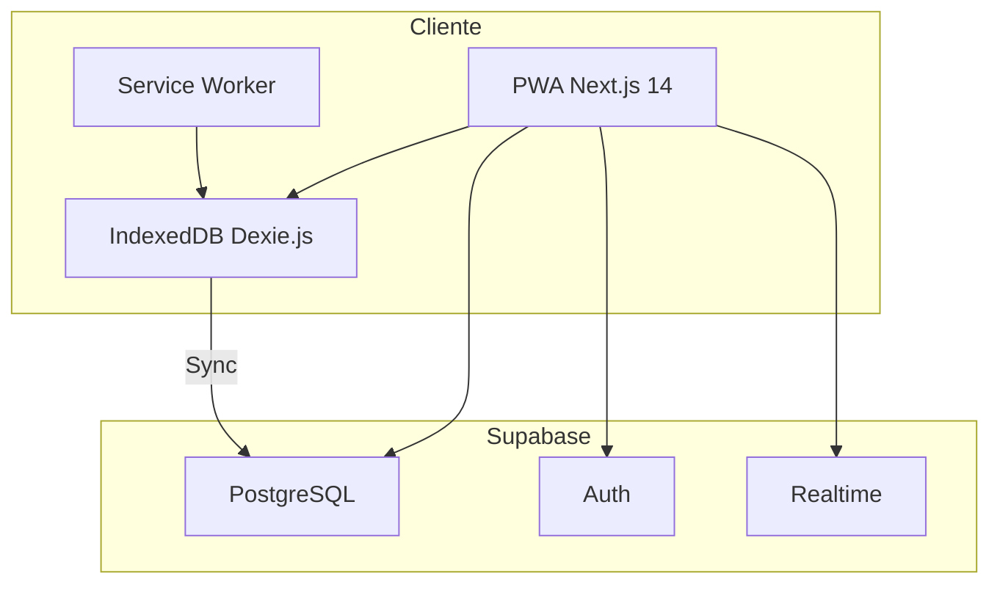
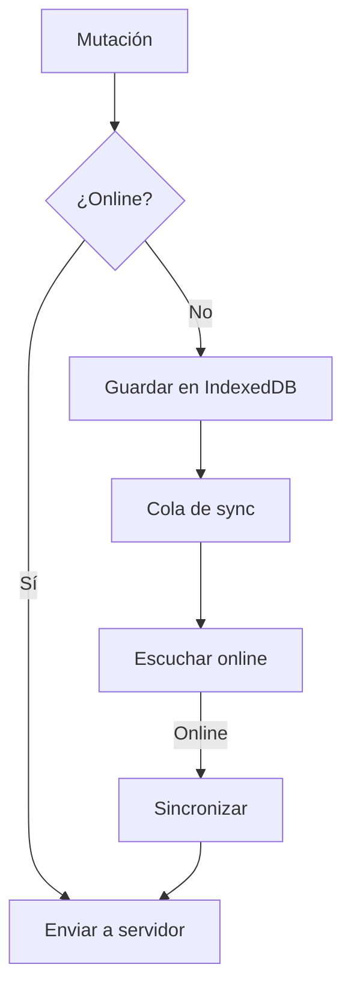

# Manual Técnico - LoyaltyVibes

## Tabla de Contenidos

1. [Arquitectura del Sistema](#arquitectura-del-sistema)
2. [Estructura del Proyecto](#estructura-del-proyecto)
3. [Base de Datos](#base-de-datos)
4. [API y Servicios](#api-y-servicios)
5. [Seguridad](#seguridad)
6. [Funcionalidades Offline](#funcionalidades-offline)
7. [Despliegue](#despliegue)
8. [Contribución](#contribución)

---

## Arquitectura del Sistema

### Visión General



### Componentes Principales

| Componente | Tecnología | Propósito |
|------------|------------|-----------|
| Frontend | Next.js 14 + React | Interfaz de usuario |
| Estilos | Tailwind CSS | Diseño responsivo |
| Base de Datos | PostgreSQL (Supabase) | Almacenamiento persistente |
| Auth | Supabase Auth | Gestión de identidades |
| Offline | Dexie.js + IndexedDB | Almacenamiento local |
| Validación | Zod + React Hook Form | Validación de formularios |

### Patrón de Arquitectura

El proyecto sigue una **arquitectura basada en características** (Feature-based):

```
src/
├── app/                    # Rutas y páginas Next.js
├── features/              # Módulos por funcionalidad
│   ├── auth/
│   ├── gamification/
│   ├── transactions/
│   ├── wallet/
│   └── rewards/
├── shared/                # Componentes compartidos
│   ├── components/
│   ├── hooks/
│   └── lib/
```

---

## Estructura del Proyecto

### Directorio Raíz

```
loyaltyvibes/
├── .claude/               # Configuración MoAI-ADK
├── .github/               # Workflows de GitHub
├── .moai/                 # Especificaciones MoAI
├── doc/                   # Documentación
├── public/                # Archivos estáticos
├── src/
│   ├── app/               # App Router pages
│   ├── features/          # Módulos de negocio
│   └── shared/            # Código compartido
├── supabase/              # Migraciones DB
└── package.json
```

### Estructura de Features

Cada feature sigue el patrón:

```
features/[nombre]/
├── types.ts              # Tipos TypeScript
├── components/           # Componentes React
├── hooks/                # Custom hooks
├── services/             # Servicios API
└── __tests__/           # Tests
```

### Estructura de Componentes UI

```
shared/components/ui/
├── Alert/
├── Button/
├── data-display/
│   ├── Avatar/
│   ├── Badge/
│   ├── Card/
│   └── StatCard/
├── forms/
│   ├── Checkbox/
│   ├── TextField/
│   └── Select/
└── index.ts             # Export barrel
```

---

## Base de Datos

### Esquema de Tablas

#### Tabla: `profiles`

```sql
CREATE TABLE public.profiles (
    id UUID PRIMARY KEY REFERENCES auth.users(id) ON DELETE CASCADE,
    email TEXT NOT NULL,
    name TEXT,
    role TEXT DEFAULT 'customer',
    tier TEXT DEFAULT 'explorador',
    points_balance INTEGER DEFAULT 0,
    total_spent DECIMAL(10,2) DEFAULT 0,
    visit_count INTEGER DEFAULT 0,
    created_at TIMESTAMPTZ DEFAULT NOW(),
    updated_at TIMESTAMPTZ DEFAULT NOW()
);
```

#### Tabla: `transactions`

```sql
CREATE TABLE public.transactions (
    id UUID PRIMARY KEY DEFAULT gen_random_uuid(),
    user_id UUID REFERENCES public.profiles(id) ON DELETE CASCADE,
    type TEXT NOT NULL,
    amount DECIMAL(10,2) NOT NULL,
    points INTEGER NOT NULL,
    points_before INTEGER NOT NULL,
    points_after INTEGER NOT NULL,
    multiplier_applied DECIMAL(3,2) DEFAULT 1.0,
    tier_at_transaction TEXT NOT NULL,
    description TEXT NOT NULL,
    status TEXT DEFAULT 'pending',
    staff_id UUID REFERENCES public.profiles(id),
    created_at TIMESTAMPTZ DEFAULT NOW(),
    processed_at TIMESTAMPTZ
);
```

#### Tabla: `rewards`

```sql
CREATE TABLE public.rewards (
    id UUID PRIMARY KEY DEFAULT gen_random_uuid(),
    name TEXT NOT NULL,
    description TEXT NOT NULL,
    points_cost INTEGER NOT NULL,
    stock INTEGER,
    image_url TEXT,
    min_tier TEXT NOT NULL,
    category TEXT NOT NULL,
    is_active BOOLEAN DEFAULT true,
    is_limited BOOLEAN DEFAULT false,
    created_at TIMESTAMPTZ DEFAULT NOW(),
    updated_at TIMESTAMPTZ DEFAULT NOW()
);
```

#### Tabla: `redemptions`

```sql
CREATE TABLE public.redemptions (
    id UUID PRIMARY KEY DEFAULT gen_random_uuid(),
    user_id UUID REFERENCES public.profiles(id) ON DELETE CASCADE,
    reward_id UUID REFERENCES public.rewards(id) ON DELETE CASCADE,
    points_used INTEGER NOT NULL,
    redemption_code TEXT NOT NULL,
    status TEXT DEFAULT 'pending',
    claimed_at TIMESTAMPTZ,
    expires_at TIMESTAMPTZ,
    created_at TIMESTAMPTZ DEFAULT NOW()
);
```

#### Tabla: `tier_history`

```sql
CREATE TABLE public.tier_history (
    id UUID PRIMARY KEY DEFAULT gen_random_uuid(),
    user_id UUID REFERENCES public.profiles(id) ON DELETE CASCADE,
    previous_tier TEXT NOT NULL,
    new_tier TEXT NOT NULL,
    promoted_at TIMESTAMPTZ DEFAULT NOW()
);
```

### Índices

```sql
CREATE INDEX idx_profiles_email ON public.profiles(email);
CREATE INDEX idx_profiles_role ON public.profiles(role);
CREATE INDEX idx_profiles_tier ON public.profiles(tier);
CREATE INDEX idx_transactions_user_id ON public.transactions(user_id);
CREATE INDEX idx_transactions_created_at ON public.transactions(created_at DESC);
CREATE INDEX idx_redemptions_user_id ON public.redemptions(user_id);
```

### Funciones y Triggers

#### Función: Actualización de timestamp

```sql
CREATE OR REPLACE FUNCTION update_updated_at_column()
RETURNS TRIGGER AS $$
BEGIN
    NEW.updated_at = NOW();
    RETURN NEW;
END;
$$ LANGUAGE plpgsql;

CREATE TRIGGER profiles_updated_at
    BEFORE UPDATE ON public.profiles
    FOR EACH ROW
    EXECUTE FUNCTION update_updated_at_column();
```

#### Función: Promoción automática de nivel

```sql
CREATE OR REPLACE FUNCTION public.check_tier_promotion()
RETURNS TRIGGER AS $$
DECLARE
    new_tier TEXT;
BEGIN
    IF NEW.total_spent >= 15000 AND NEW.visit_count >= 15 THEN
        new_tier := 'embajador';
    ELSIF NEW.total_spent >= 5000 AND NEW.visit_count >= 5 THEN
        new_tier := 'conocedor';
    ELSE
        new_tier := 'explorador';
    END IF;

    IF (new_tier = 'embajador') OR
       (new_tier = 'conocedor' AND NEW.tier = 'explorador') THEN
        NEW.tier := new_tier;
    END IF;

    RETURN NEW;
END;
$$ LANGUAGE plpgsql SECURITY DEFINER;
```

#### Función: Procesamiento de transacciones

```sql
CREATE OR REPLACE FUNCTION public.process_transaction()
RETURNS TRIGGER AS $$
BEGIN
    IF NEW.status = 'completed' AND (OLD IS NULL OR OLD.status != 'completed') THEN
        UPDATE public.profiles
        SET points_balance = NEW.points_after,
            updated_at = NOW()
        WHERE id = NEW.user_id;

        IF NEW.type = 'earn' THEN
            UPDATE public.profiles
            SET total_spent = total_spent + NEW.amount,
                visit_count = visit_count + 1
            WHERE id = NEW.user_id;
        END IF;
    END IF;
    RETURN NEW;
END;
$$ LANGUAGE plpgsql SECURITY DEFINER;
```

### Políticas RLS (Row Level Security)

```sql
-- Usuarios leen su propio perfil
CREATE POLICY "Users can read own profile"
ON public.profiles FOR SELECT
USING (auth.uid() = id);

-- Staff puede crear transacciones
CREATE POLICY "Staff can create transactions"
ON public.transactions FOR INSERT
WITH CHECK (
    EXISTS (
        SELECT 1 FROM public.profiles
        WHERE id = auth.uid() AND role IN ('admin', 'staff')
    )
);
```

---

## API y Servicios

### Servicios del Cliente

#### Auth Service (`features/auth/services/authService.ts`)

```typescript
export const authService = {
  async register(input: RegisterInput): Promise<AuthResult<Profile>>;
  async login(input: LoginInput): Promise<AuthResult<Profile>>;
  async logout(): Promise<void>;
  async getProfile(userId: string): Promise<Profile | null>;
};
```

#### Transactions Service (`features/transactions/services/transactionService.ts`)

```typescript
export const transactionService = {
  async createTransaction(input: CreateTransactionInput): Promise<Transaction>;
  async getTransactions(userId: string): Promise<Transaction[]>;
  async getTransactionSummary(userId: string): Promise<TransactionSummary>;
};
```

#### Rewards Service (`features/rewards/services/rewardsService.ts`)

```typescript
export const rewardsService = {
  async getActiveRewards(userTier: TierLevel, options?: RewardFilterOptions): Promise<RewardWithAvailability[]>;
  async getRewardById(id: string): Promise<Reward | null>;
  async redeemReward(input: RedeemRewardInput): Promise<RedemptionResult>;
  async createReward(input: CreateRewardInput): Promise<Reward>;
};
```

### Hooks Personalizados

#### useAuth (`features/auth/hooks/useAuth.ts`)

```typescript
function useAuth() {
  // Estado
  const { user, isLoading, isAuthenticated, error } = state;
  
  // Funciones
  const login: (input: LoginInput) => Promise<boolean>;
  const register: (input: RegisterInput) => Promise<boolean>;
  const logout: () => Promise<void>;
}
```

#### useProfile (`features/auth/hooks/useProfile.ts`)

```typescript
function useProfile() {
  const { profile, loading, error, updateProfile } = state;
  // Carga y actualiza el perfil del usuario
}
```

#### useTierCalculation (`features/gamification/hooks/useTierCalculation.ts`)

```typescript
function useTierCalculation() {
  const { currentTier, totalSpent, visitCount } = profile;
  
  const getNextTier: () => TierLevel | null;
  const getTierProgress: () => TierProgress;
  const calculateTier: (spent: number, visits: number) => TierLevel;
}
```

#### useOfflineMutation (`features/transactions/hooks/useOfflineMutation.ts`)

```typescript
function useOfflineMutation() {
  // Maneja mutaciones cuando no hay conexión
  const { pendingMutations, sync, isOnline } = state;
}
```

---

## Seguridad

### Autenticación

- **Proveedor**: Supabase Auth
- **Métodos**: Email/Password
- **Sesiones**: JWT con refresh token

### Autorización

- **RLS**: Políticas a nivel de fila en PostgreSQL
- **Middleware**: Verificación de roles en cada请求

### Códigos QR Dinámicos

```typescript
// Generación de JWT para QR
const token = await new SignJWT({
  sub: userId,
  iat: Date.now(),
  exp: Date.now() + 60000, // 60 segundos
  nonce: crypto.randomUUID()
}).sign(key);
```

### Validación de Formularios

- **Zod**: Esquemas de validación en el cliente
- **React Hook Form**: Manejo de formulario con resolver Zod

---

## Funcionalidades Offline

### Arquitectura Offline-First



### IndexedDB con Dexie.js

```typescript
// db/dexie.ts
class LoyaltyVibesDB extends Dexie {
  offlineTransactions!: Table<OfflineTransaction, number>;
  cachedProfiles!: Table<CachedProfile, string>;
  syncOperations!: Table<SyncOperation, number>;
  
  constructor() {
    super('LoyaltyVibesDB');
    this.version(1).stores({
      offlineTransactions: '++id, sync_id, user_id, created_at, synced',
      cachedProfiles: 'id, updated_at',
      syncOperations: '++id, operation, table, created_at, synced'
    });
  }
}
```

### Service Worker

```typescript
// public/sw.js
self.addEventListener('install', (event) => {
  // Cachear assets estáticos
});

self.addEventListener('fetch', (event) => {
  // Estrategia: Network first, fallback a cache
});

self.addEventListener('sync', (event) => {
  // Sincronización en background
});
```

---

## Despliegue

### Requisitos Previos

```bash
Node.js >= 18.x
npm >= 9.x o yarn >= 1.22.x
Cuenta de Supabase
```

### Variables de Entorno

```env
# Supabase Configuration
NEXT_PUBLIC_SUPABASE_URL=https://your-project.supabase.co
NEXT_PUBLIC_SUPABASE_ANON_KEY=your-anon-key

# Optional: Service role key (solo para server-side)
SUPABASE_SERVICE_ROLE_KEY=your-service-role-key
```

### Instalación

```bash
# Clonar repositorio
git clone <repo-url>
cd loyaltyvibes

# Instalar dependencias
npm install

# Configurar variables de entorno
cp .env.local.example .env.local
# Editar .env.local con tus credenciales

# Ejecutar migraciones de base de datos
npx supabase migration up

# Iniciar servidor de desarrollo
npm run dev
```

### Builds de Producción

```bash
# Build de producción
npm run build

# Preview de build
npm run start

# Linting
npm run lint

# Tests
npm test
npm run test:coverage
```

### Despliegue en Vercel

```bash
# Instalar Vercel CLI
npm i -g vercel

# Deploy
vercel

# Configurar variables de entorno en Vercel Dashboard
```

---

## Contribución

### Configuración de Desarrollo

1. Fork del repositorio
2. Clonar fork localmente
3. Crear rama feature: `git checkout -b feature/nueva-funcionalidad`
4. Desarrollar con tests
5. Ejecutar linting: `npm run lint`
6. Ejecutar tests: `npm test`
7. Commit y push
8. Crear Pull Request

### Convenciones de Código

- **TypeScript**: Tipado estricto
- **Commits**: Conventional Commits (`feat:`, `fix:`, `docs:`)
- **命名**: camelCase para funciones, PascalCase para componentes

### Testing

```bash
# Tests unitarios
npm test

# Tests en modo watch
npm run test:watch

# Cobertura
npm run test:coverage
```

---

## API Reference

### Tipos Principales

```typescript
// Perfil de usuario
interface Profile {
  id: string;
  email: string;
  name: string | null;
  role: 'admin' | 'staff' | 'customer';
  tier: 'explorador' | 'conocedor' | 'embajador';
  points_balance: number;
  total_spent: number;
  visit_count: number;
}

// Transacción
interface Transaction {
  id: string;
  user_id: string;
  type: 'earn' | 'redeem' | 'adjustment' | 'expiry';
  amount: number;
  points: number;
  points_before: number;
  points_after: number;
  multiplier_applied: number;
  tier_at_transaction: TierLevel;
  description: string;
  status: 'pending' | 'completed' | 'cancelled' | 'failed';
}

// Recompensa
interface Reward {
  id: string;
  name: string;
  description: string;
  points_cost: number;
  stock: number | null;
  min_tier: TierLevel;
  category: RewardCategory;
  is_active: boolean;
}
```

---

## Siguientes Pasos

- Volver a: [Introducción](01-introduccion.md)
- Continuar con: [Manual de Usuario](03-manual-usuario.md)
