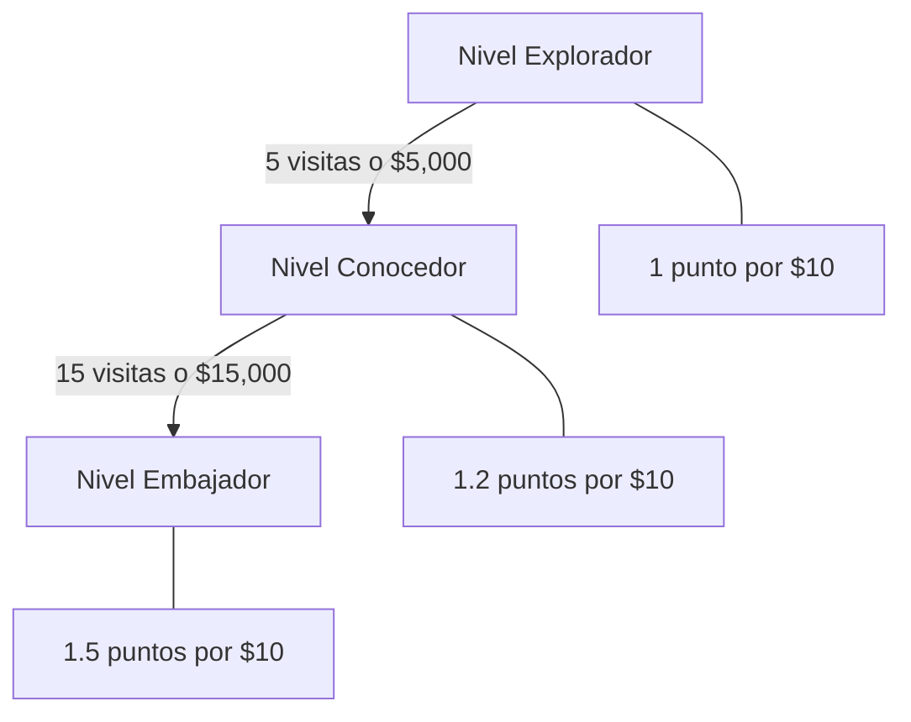

# Manual de Usuario - LoyaltyVibes

## Tabla de Contenidos

1. [Introducción](#introducción)
2. [Primeros Pasos](#primeros-pasos)
3. [Guía del Cliente](#guía-del-cliente)
4. [Guía del Personal](#guía-del-personal)
5. [Guía del Administrador](#guía-del-administrador)
6. [Preguntas Frecuentes](#preguntas-frecuentes)
7. [Solución de Problemas](#solución-de-problemas)

---

## Introducción

### ¿Qué es LoyaltyVibes?

LoyaltyVibes es la aplicación de fidelización de tus establecimientos favoritos en San Cristóbal de Las Casas. Acumula puntos en cada visita y canjéalos por recompensas exclusivas.

### Beneficios del Programa

| Beneficio | Descripción |
|-----------|-------------|
| **Puntos por consumo** | 1 punto por cada $10 MXN gastado |
| **Niveles VIP** | 3 niveles con beneficios exclusivos |
| **Recompensas** | Canjea puntos por productos y experiencias |
| **Historial** | Consulta todas tus transacciones |

### Niveles de Lealtad



| Nivel | Requisitos | Multiplicador |
|-------|------------|---------------|
| **Explorador** | Registro inicial | 1x |
| **Conocedor** | 5 visitas + $5,000 MXN | 1.2x |
| **Embajador** | 15 visitas + $15,000 MXN | 1.5x |

---

## Primeros Pasos

### Descarga e Instalación

LoyalVibes es una **Progressive Web App (PWA)**, lo que significa:

1. **No necesitas tienda de apps** - Accedes directamente desde tu navegador
2. **Instálala en tu teléfono** - Como app nativa
3. **Funciona Offline** - Guarda datos localmente

#### Cómo instalar en Android/iOS:

**Safari (iOS)**:
1. Abre loyaltyvibes.app en Safari
2. Toca el botón compartir
3. Selecciona "Añadir a pantalla de inicio"

**Chrome (Android)**:
1. Abre loyaltyvibes.app en Chrome
2. Toca los tres puntos
3. Selecciona "Instalar app" o "Añadir a pantalla de inicio"

### Crear tu Cuenta

1. Abre la aplicación
2. Toca **"Registrarse"**
3. Ingresa tu email
4. Crea una contraseña segura (mínimo 8 caracteres, una mayúscula y un número)
5. Opcional: Ingresa tu nombre
6. Toca **"Crear Cuenta"**

¡Listo! Ya eres **Explorador** y puedes empezar a acumular puntos.

---

## Guía del Cliente

### Tu Wallet

La pantalla principal de tu wallet muestra:

```tsx
┌─────────────────────────────────┐
│  LoyaltyVibes           🏆 VIP  │
├─────────────────────────────────┤
│  Tus Puntos                     │
│  1,250                          │
│  puntos disponibles             │
├─────────────────────────────────┤
│  💰 $0        │  🏠 3 visitas    │
│  gastado      │  🎁 0 rewards    │
└─────────────────────────────────┘
```

### Código QR Personal

Tu código QR está disponible en la sección de tu wallet:

1. Abre la aplicación
2. Busca el código QR en pantalla
3. Muéstralo al mesero/cajero

**Importante**: Tu código cambia cada 30-60 segundos por seguridad. ¡No necesitas hacer nada, la app lo actualiza automáticamente!

### Acumular Puntos

1. Llega a uno de nuestros establecimientos
2. Muestra tu código QR al mesero
3. El mesero escanea tu código
4. Ingresa el monto de tu consumo
5. ¡Tus puntos se acumulan automáticamente!

**Ejemplo**:
- Gastas $500 MXN
- Eres Explorador (1x): Recibes 50 puntos
- Eres Embajador (1.5x): Recibes 75 puntos

### Ver tu Progreso

1. Toca la sección **"Progreso"** o **"Wallet"**
2. Visualiza:
   - Tu nivel actual
   - Puntos para siguiente nivel
   - Visitas acumuladas
   - Total gastado

```tsx
┌─────────────────────────────────┐
│  Progreso de Nivel              │
├─────────────────────────────────┤
│  Hacia Conocedor                │
│  ▓▓▓▓▓▓░░░░░░░░░░░░░░░  60%    │
│                                 │
│  Faltan 2 visitas o $2,000      │
│  para subir de nivel            │
└─────────────────────────────────┘
```

### Canjear Recompensas

1. Toca **"Recompensas"** en el menú
2. Explora las recompensas disponibles
3. Filtra por categoría si lo deseas
4. Selecciona una recompensa
5. Verifica los puntos requeridos
6. Toca **"Canjear"**
7. Guarda tu código de canje

**Código de ejemplo**: `LV-ABCD-1234-EFGH`

### Historial de Transacciones

1. Toca **"Historial"** en el menú
2. Ver todas tus transacciones
3. Filtra por tipo:
   - **Ganancias**: Puntos acumulados
   - **Canjes**: Puntos canjeados
   - **Ajustes**: Cambios manuales

### Tu Perfil

1. Toca **"Perfil"** en el menú
2. Puedes:
   - Ver tu información
   - Editar tu nombre
   - Ver tu nivel y estadísticas
   - Ver fecha de registro

### Cerrar Sesión

1. En tu perfil, toca **"Cerrar Sesión"**
2. Confirma que deseas salir

---

## Guía del Personal

### Iniciar Sesión como Staff

1. Abre la aplicación
2. Ingresa tus credenciales de staff
3. Serás redirigido a la terminal de escaneo

### Escanear Código QR

1. Toca **"Escanear"**
2. Permite acceso a la cámara
3. Apunta al código QR del cliente
4. El código se valida automáticamente

### Procesar Transacción

1. Una vez escaneado, ingresa el **monto del consumo**
2. Toca **"Procesar"**
3. El sistema:
   - Calcula los puntos según el nivel del cliente
   - Registra la transacción
   - Muestra confirmación

```tsx
┌─────────────────────────────────┐
│  Cliente: Juan Pérez            │
│  Nivel: Conocedor (1.2x)        │
│                                 │
│  Monto: $350.00 MXN             │
│  Puntos: 42 (35 × 1.2)          │
│                                 │
│  ┌─────────────────────────┐    │
│  │     PROCESAR           │    │
│  └─────────────────────────┘    │
└─────────────────────────────────┘
```

### Modo Offline

Si no hay internet:

1. El sistema guarda la transacción localmente
2. Verás "Pendiente de sincronización"
3. Cuando haya conexión, se sincroniza automáticamente
4. No necesitas hacer nada extra

---

## Guía del Administrador

### Acceder al Panel

1. Inicia sesión con credenciales de admin
2. Serás redirigido al dashboard

### Dashboard Principal

El dashboard muestra:

```tsx
┌─────────────────────────────────────────┐
│  Panel de Administración                 │
├─────────────────────────────────────────┤
│  ┌─────────┐  ┌─────────┐  ┌─────────┐  │
│  │ 👥 156  │  │ 🎁 2,450 │  │ 📊 23   │  │
│  │ Usuarios│  │ Puntos  │  │ Hoy     │  │
│  │ Totales │  │ Totales │  │ Transac.│  │
│  └─────────┘  └─────────┘  └─────────┘  │
├─────────────────────────────────────────┤
│  Acciones Rápidas                       │
│  ┌─────────┐ ┌─────────┐ ┌─────────┐   │
│  │ Usuarios│ │ Transac.│ │ Recomp. │   │
│  └─────────┘ └─────────┘ └─────────┘   │
└─────────────────────────────────────────┘
```

### Métricas Disponibles

| Métrica | Descripción |
|---------|-------------|
| Total Usuarios | Usuarios registrados |
| Puntos Emitidos | Total de puntos acumulados por todos |
| Transacciones Hoy | Transacciones del día actual |

### Gestión de Usuarios

1. Toca **"Gestionar Usuarios"**
2. Busca por email o nombre
3. Visualiza:
   - Nivel actual
   - Total de puntos
   - Historial de visitas
   - Historial de niveles

### Gestión de Transacciones

1. Toca **"Ver Transacciones"**
2. Filtra por:
   - Fecha
   - Tipo (ganancia/canje)
   - Usuario
3. Exporta datos si es necesario

### Gestión de Recompensas

1. Toca **"Recompensas"**
2. Puedes:
   - **Crear nueva**: Define nombre, costo, categoría, nivel mínimo
   - **Editar**: Modifica recompensas existentes
   - **Desactivar**: Oculta recompensas temporalmente
   - **Ver estadísticas**: Veces canjeada, puntos generados

### Configurar Recompensas

**Crear nueva recompensa**:

1. Toca **"Nueva Recompensa"**
2. Completa el formulario:

| Campo | Descripción |
|-------|-------------|
| Nombre | Título de la recompensa |
| Descripción | Detalles de lo que incluye |
| Costo en puntos | Puntos necesarios para canjear |
| Categoría | food, drink, merchandise, experience, discount |
| Nivel mínimo | Explorador / Conocedor / Embajador |
| Stock | Cantidad disponible (dejar vacío para ilimitado) |
| Imagen | URL de imagen (opcional) |

---

## Preguntas Frecuentes

### Generales

**¿Cuánto cuesta usar LoyaltyVibes?**
> Es completamente gratis para los clientes.

**¿Puedo usar la app en varios establecimientos?**
> ¡Sí! LoyaltyVibes funciona en todos los establecimientos participantes.

**¿Mis puntos expiran?**
> Consulta los términos específicos de cada establecimiento.

### Puntos y Niveles

**¿Cómo subo de nivel?**
> Acumula visitas y gasto según los umbrales de cada nivel.

**¿Puedo perder mi nivel?**
> El sistema solo promueve, nunca degrada niveles.

**¿El multiplicador aplica a todas las compras?**
> Sí, tu multiplicador siempre aplica.

### Recompensas

**¿Puedo canjear puntos por dinero en efectivo?**
> No, los puntos se canjean únicamente por recompensas del catálogo.

**¿Qué pasa si una recompensa tiene stock limitado?**
> Se.canjea por orden de solicitud hasta agotar stock.

**¿Puedo transferir mis puntos a otro usuario?**
> No, los puntos son intransferibles.

### Técnico

**¿La app funciona sin internet?**
> Sí, muchas funciones funcionan offline y se sincronizan después.

**¿Es seguro mi código QR?**
> Sí, tu código cambia cada 30-60 segundos para prevenir fraudes.

**¿Puedo usar la app en mi computadora?**
> Sí, funciona en cualquier navegador web.

---

## Solución de Problemas

### No puedo iniciar sesión

1. Verifica tu email y contraseña
2. Asegúrate de tener conexión a internet
3. Intenta recuperar tu contraseña:
   - Toca "¿Olvidaste tu contraseña?"
   - Ingresa tu email
   - Revisa tu bandeja de entrada

### Mi código QR no funciona

1. Asegúrate de tener buena iluminación
2. Mantén el teléfono firme
3. Verifica que el código no esté dañado
4. Espera a que el código se regenera (cada 30-60 segundos)

### Mis puntos no aparecen

1. Verifica tu conexión a internet
2. Desliza hacia abajo para refrescar
3. Espera unos segundos a que sincronice
4. Si el problema persiste, contacta al establecimiento

### La app no carga

1. Verifica tu conexión a internet
2. Cierra y vuelve a abrir la app
3. Reinicia tu teléfono
4. Desinstala y reinstala la app

### Error de sincronización offline

1. Asegúrate de tener conexión a internet
2. Espera unos minutos
3. Verifica que la transacción aparece como "Pendiente"
4. Cuando haya conexión, debería sincronizarse automáticamente

### Contacto de Soporte

Si ninguno de estos pasos funciona:

- **Email**: soporte@loyaltyvibes.app
- **Teléfono**: [del establecimiento]
- **Horario**: [horario de atención]

---

## Glosario

| Término | Definición |
|---------|------------|
| **Wallet** | Tu billetera digital de puntos |
| **Puntos** | Moneda virtual acumulada por compras |
| **Nivel** | Tu estado en el programa de lealtad |
| **Multiplicador** | Factor que aumenta tus puntos ganados |
| **Recompensa** | Premio que puedes canjear con puntos |
| **Código QR** | Código escaneable con tus datos |
| **Offline** | Sin conexión a internet |
| **Sincronizar** | Actualizar datos con el servidor |

---

## Siguientes Pasos

- Volver a: [Introducción](01-introduccion.md)
- Volver a: [Manual Técnico](02-manual-tecnico.md)
